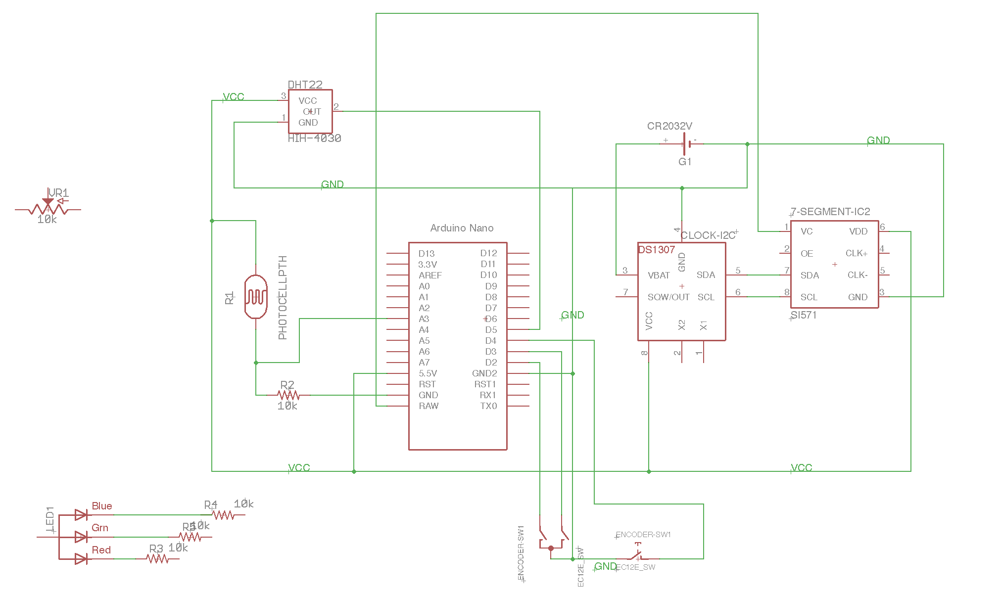

## Wall Clock 

This is a repo of a complex Arduino project, which relies on several custom and built-in libraries.

This project originated from [arduino-cmake](https://github.com/arduino-cmake/arduino-cmake), but the author could not figure out how to properly build libraries, neither Arduino built-in libraries, or the custom user-provided libraries.

So a CMake extension was born out of desperation, and a few goodies were added along the way: 

 * You can change the board type by setting `BOARD_NAME` environment variable to, say, "nano"
 * You can force the port/device using `BOARD_DEVICE` environment variable. If not set, device it attempted to be automatically detected by listing various ports under `/dev`. Note, that if you are relying on auto-detection, be sure not to have more than one board plugged in. If CMake function detects more than one device, it gives up, and requires you to set it externally.

 
### Schematic

Here is an approximate schematic using Arduino Nano:

### Dependencies

This project depends on the following libraries:

 * DS1307RTC
 * Adafruit_LEDBackpack
 * Adafruit_GFX
 * Adafruit_NeoPixel
 * Adafruit_Sensor
 * DHT
 * OneButton
 * SimpleTimer
 * Time
 
## Contributing

Bug reports and pull requests are welcome on GitHub at [https://github.com/kigster/wallclock-arduino](https://github.com/kigster/wallclock-arduino).

## Author

&copy; 2014-2017 Konstantin Gredeskoul, all rights reserved.

## License

This project is distributed under the [MIT License](https://raw.githubusercontent.com/kigster/wallclock-arduino/master/LICENSE).
